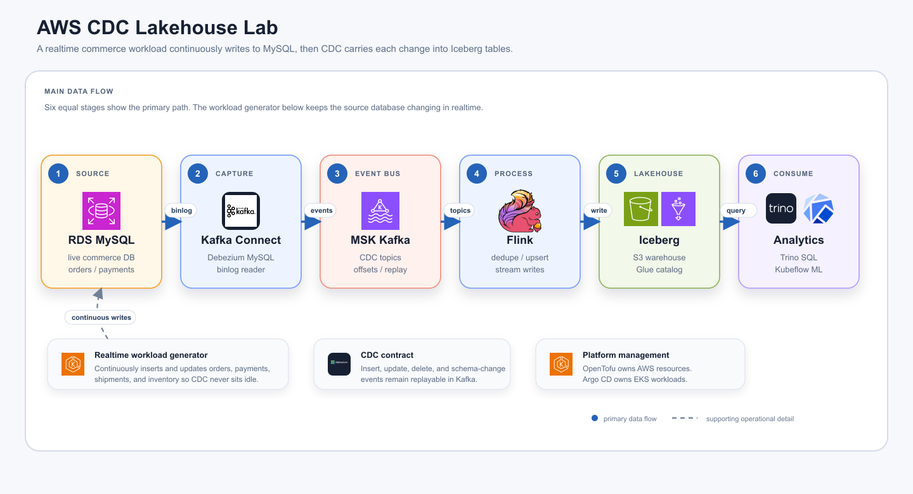

# AWS CDC Lakehouse Lab

Reproducible infrastructure and Kubernetes service definitions for a commerce-domain
CDC data platform:



Diagram source/export: [SVG](docs/assets/cdc-lakehouse-architecture.svg), [draw.io companion](docs/diagrams/cdc-lakehouse-architecture.drawio).

## Quick Start

This tutorial repository intentionally does not commit `k8s/rendered/`.
Generate it after OpenTofu creates environment-specific outputs such as ECR
image URLs, IAM role ARNs, S3 bucket names, and Kafka bootstrap brokers.

```bash
LAB_ID=tutorial-$USER scripts/labctl.sh init
scripts/labctl.sh plan
scripts/labctl.sh deploy
```

The deploy command applies OpenTofu, builds and pushes the source generator and
Flink runtime images, renders `k8s/rendered/`, commits and pushes that rendered
overlay, installs Argo CD, configures private-repo access with a lab deploy key,
and applies the rendered root application.

```bash
scripts/labctl.sh status
```

See [docs/deploy-runbook.md](docs/deploy-runbook.md) for the full manual flow.

## Codex Setup Skill

If you are using Codex, you can invoke the bundled `cdc-lakehouse-lab` setup
skill to run the same setup path more simply. It guides the lab through
OpenTofu, image build/push, rendered GitOps manifests, Argo CD setup, and basic
status checks without manually stepping through each command.

The first milestone is infrastructure readiness, not running every workload by
default. OpenTofu provisions AWS infrastructure, and Argo CD manages the EKS
services that can be added or removed independently.

## Pipeline Roles

| Layer | Component | Role |
| --- | --- | --- |
| Source | RDS MySQL | Operational schemas that behave like commerce services. |
| CDC runtime | Kafka Connect + Debezium | Reads MySQL binlog, manages connector tasks and offsets, and publishes change events. |
| Transport | MSK | Durable Kafka topics for CDC events and Kafka Connect internal state. |
| Stream processing | Flink | Converts Debezium events into Bronze/Silver/Gold Iceberg tables. |
| Lakehouse storage | S3 + Iceberg | Stores table data files and Iceberg metadata. |
| Catalog | Glue Data Catalog | Provides the Iceberg catalog used by Flink and Trino. |
| Consumption | Trino / Kubeflow | SQL analytics and ML/experiment workflows over lakehouse data. |

## Repository Layout

```text
infra/opentofu/     AWS infrastructure: VPC, EKS, RDS, MSK, S3, Glue, IAM
k8s/argocd/         Argo CD root app and child applications
k8s/apps/           Kubernetes manifests for data-platform services
k8s/rendered/       Generated GitOps overlay; created per lab and not committed in this seed repo
apps/generator/     Commerce schema bootstrap and workload generator
flink/sql/          CDC-to-Iceberg SQL templates
docs/               Architecture, deployment, teardown, and operations notes
```

## Data Walkthrough

The lab simulates a small commerce system rather than a single toy table. The
source generator first bootstraps operational MySQL schemas, then keeps applying
new inserts, updates, and a few deletes so Debezium has a live binlog to read.

### Source Tables

| MySQL table | Grain | Example fields | What changes over time |
| --- | --- | --- | --- |
| `commerce.inventory` | One SKU | `sku`, `product_name`, `quantity`, `updated_at` | Quantity decreases when orders reserve stock. |
| `commerce.orders` | One order | `order_id`, `customer_id`, `status`, `total_amount`, `created_at`, `updated_at`, `risk_score` | New orders are created, then move through `PAID`, `PAYMENT_FAILED`, `SHIPPED`, `DELIVERED`, or `CANCELLED`. |
| `commerce.order_items` | One order line | `order_item_id`, `order_id`, `sku`, `quantity`, `unit_price` | New order lines are inserted; older lines are sometimes deleted to produce delete CDC events. |
| `payment.payments` | One payment attempt | `payment_id`, `order_id`, `status`, `amount`, `approved_at` | Payments are inserted as `APPROVED` or `FAILED`; cancelled orders can become `REFUNDED`. |
| `logistics.shipments` | One shipment | `shipment_id`, `order_id`, `status`, `carrier`, `shipped_at`, `delivered_at` | Approved orders get shipments that can become `SHIPPED` and `DELIVERED`. |

The default generator rate is `2` mutations per second in
`k8s/apps/data/source-generator/deployment.yaml`. Roughly 72% of loop iterations
create a new order, 20% mutate an existing order, and 8% delete an older order
item. The generator also applies one schema change by adding
`commerce.orders.risk_score`, which lets you observe how Debezium and downstream
jobs behave when a captured table evolves.

Example source rows after one successful order:

```sql
-- commerce.orders
order_id | customer_id | status | total_amount | risk_score
1001     | 44982       | PAID   | 119.97       | NULL

-- payment.payments
payment_id | order_id | status   | amount
501        | 1001     | APPROVED | 119.97

-- logistics.shipments
shipment_id | order_id | status | carrier
301         | 1001     | READY  | CJ
```

### CDC Topics

Kafka Connect registers a Debezium MySQL connector named
`rds-commerce-source`. It snapshots the initial data and then tails the MySQL
binlog for these tables:

```text
commerce.orders
commerce.order_items
commerce.inventory
payment.payments
logistics.shipments
```

With `topic.prefix = "rds"`, Debezium writes table-specific topics such as:

```text
rds.commerce.orders
rds.commerce.order_items
rds.commerce.inventory
rds.payment.payments
rds.logistics.shipments
```

Kafka Connect also keeps its own state in `_connect_configs`,
`_connect_offsets`, and `_connect_status`. Debezium stores schema history in
`schemahistory.rds`.

The event value uses the Debezium envelope shape. A simplified update event for
`rds.commerce.orders` looks like this:

```json
{
  "payload": {
    "before": {
      "order_id": 1001,
      "customer_id": 44982,
      "status": "PAID",
      "total_amount": "119.97"
    },
    "after": {
      "order_id": 1001,
      "customer_id": 44982,
      "status": "SHIPPED",
      "total_amount": "119.97"
    },
    "op": "u",
    "ts_ms": 1790000000000
  }
}
```

Useful operation codes are `r` for snapshot reads, `c` for inserts, `u` for
updates, and `d` for deletes. The current Flink job consumes the
`rds.commerce.orders` topic as the first end-to-end example; the other captured
topics are available for extending the lab.

### Lakehouse Tables

Flink creates the Iceberg catalog through Glue, reads Debezium events from MSK,
and writes S3-backed Iceberg tables. The current tutorial materializes the order
stream into three layers:

| Layer | Iceberg table | Grain | Write pattern | Purpose |
| --- | --- | --- | --- | --- |
| Bronze | `iceberg.lab_bronze.orders_cdc_events` | One `commerce.orders` CDC event | Append | Preserve the event history with `op`, `is_deleted`, and `event_ts`. |
| Silver | `iceberg.lab_silver.orders_current` | One current row per `order_id` | Upsert by primary key | Query the latest order state without replaying CDC yourself. |
| Gold | `iceberg.lab_gold.order_revenue_by_status` | One row per order status | Upserted aggregate | Show a serving-shaped table for dashboards or ML feature checks. |

The deployed SQL lives in `k8s/apps/data/flink-orders-cdc/configmap.yaml`. At
runtime it is mounted into the Flink job as
`/opt/flink/sql/cdc_to_iceberg.sql`. The `flink/sql/` directory is a reference
template area; use the Kubernetes ConfigMap as the source of truth for the
current tutorial deployment.

Inside that SQL, two Flink Kafka source tables read the same Debezium topic in
different ways:

| Flink table | Format | Why it exists |
| --- | --- | --- |
| `orders_envelope_kafka` | Plain JSON | Keeps access to the Debezium envelope so Bronze can store `op`, delete status, and event time. |
| `orders_changelog_kafka` | `debezium-json` | Lets Flink interpret inserts, updates, and deletes as a keyed changelog for Silver and Gold upserts. |

Example output after order `1001` moves from `PAID` to `SHIPPED`:

```sql
-- iceberg.lab_bronze.orders_cdc_events
order_id | status  | total_amount | op | is_deleted | event_ts
1001     | PAID    | 119.97       | c  | false      | 2026-06-29 10:00:01
1001     | SHIPPED | 119.97       | u  | false      | 2026-06-29 10:01:15

-- iceberg.lab_silver.orders_current
order_id | customer_id | status  | total_amount
1001     | 44982       | SHIPPED | 119.97

-- iceberg.lab_gold.order_revenue_by_status
status  | order_count | gross_amount
SHIPPED | 128         | 14592.34
PAID    | 44          | 3881.20
```

Bronze is a flattened order-event table, not a byte-for-byte archive of the full
Debezium JSON. If you want to preserve complete raw envelopes, add a separate
Bronze table that stores the original Kafka value as JSON or string.

### End-to-End Procedure

1. Choose a lab id, then initialize environment-specific values:

   ```bash
   LAB_ID=tutorial-$USER scripts/labctl.sh init
   ```

2. Review the infrastructure plan:

   ```bash
   scripts/labctl.sh plan
   ```

3. `scripts/labctl.sh deploy` provisions AWS infrastructure with OpenTofu,
   builds runtime images, renders `k8s/rendered/`, pushes the rendered GitOps
   overlay, installs Argo CD, and applies the root application.
4. Argo CD installs platform services, data services, and optional ML services
   from the rendered manifests.
5. `source-generator-bootstrap` creates the MySQL schemas and seed inventory in
   RDS.
6. `source-generator` continuously mutates the MySQL tables so the binlog keeps
   changing.
7. `kafka-connect` registers the Debezium connector and publishes table CDC
   topics into MSK.
8. `flink-orders-cdc` reads `rds.commerce.orders`, creates the Glue/Iceberg
   databases and tables, and writes Bronze/Silver/Gold outputs to S3.
9. Trino queries the Iceberg tables through Glue; Kubeflow can run validation or
   experiment pipelines against the same lakehouse data.

## What To Check

Most services are private inside the EKS cluster. Use port-forwarding from your
local machine when you want to inspect them.

| Component | What to look at | Command | URL |
| --- | --- | --- | --- |
| Argo CD | Application sync and health status | `kubectl -n argocd port-forward svc/argocd-server 8080:443` | `https://localhost:8080` |
| Flink | Running/failed jobs, checkpoints, TaskManagers, job exceptions | `kubectl -n data port-forward svc/orders-cdc-rest 8082:8081` | `http://localhost:8082` |
| Trino | Cluster status and query history | `kubectl -n data port-forward svc/trino 8084:8080` | `http://localhost:8084/ui/` |
| Kafka Connect | Connector status and task failures | `kubectl -n data port-forward svc/kafka-connect 8083:8083` | `http://localhost:8083/connectors` |

For quick status checks:

```bash
kubectl -n argocd get applications
kubectl -n data get pods,svc
kubectl -n data get flinkdeployment orders-cdc
```

Useful logs while debugging the CDC path:

```bash
kubectl -n data logs deploy/kafka-connect
kubectl -n data logs deploy/source-generator
kubectl -n data logs deploy/trino-coordinator
kubectl -n data logs deploy/flink-kubernetes-operator
kubectl -n data logs -l app=orders-cdc,component=jobmanager
kubectl -n data logs -l app=orders-cdc,component=taskmanager
```

Trino's built-in Web UI is mainly for monitoring and query history. Run ad hoc
SQL through the Trino CLI in the coordinator pod:

```bash
kubectl -n data exec -it deploy/trino-coordinator -- trino --server http://localhost:8080
```

Starter queries:

```sql
SHOW CATALOGS;
SHOW SCHEMAS FROM iceberg;
SHOW TABLES FROM iceberg.lab_bronze;
SELECT * FROM iceberg.lab_bronze.orders_cdc_events LIMIT 10;
SELECT * FROM iceberg.lab_silver.orders_current LIMIT 10;
SELECT * FROM iceberg.lab_gold.order_revenue_by_status ORDER BY gross_amount DESC;
```

## MSK Scope

This tutorial walkthrough uses provisioned MSK. That keeps broker count,
replication settings, storage, and broker metrics visible for data-engineering
practice. Serverless MSK is intentionally outside the documented path because
it changes the authentication and client configuration work for Kafka Connect
and Flink.
